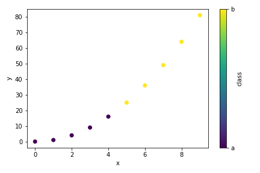

# `pandas`: encode categorical data | `matplotlib`: color data by category


### Context
While trying to visualize ICPMS external standard calibration curves, I had 
some values that clusted at similar reference compositions (abscissa) but 
"noisy" measured intensities (ordinate). A lack of differentiating style 
between the different standards used to define the calibration curve made it 
hard to tell if these data were from 2 standards with coincidentally similar 
compositions, or poor precision replicate analyses of a single standard. I 
didn't need the full power of `seaborn`'s `hue`, so I figured I'd just add a 
little styling with `pandas` & `matplotlib`.


### Code
```python
# GET ARRAY OF NUMERICAL CODES FOR CATEGORICAL DATA VIA DTYPE CONVERSION
# N.B. doesn't permit category-wise labeling in legend
codes = df[categorical_col].astype('category').cat.codes


# EXAMPLE
import pandas as pd
from matplotlib import pyplot as plt

df = pd.DataFrame({
    "x": np.arange(10),
    "y": np.arange(10)**2,
    "group": 5*["a"] + 5*["b"]
})

# encode non-numeric `"group"` Series as categorical data
catClass = df["group"].astype('category')

plt.scatter(df.x, df.y, c=catClass.cat.codes)
plt.xlabel("x"); plt.ylabel("y")

# make colorbar, w/ ticks at catClass codes and label with category
plt.colorbar(
    label="class",
    ticks=catClass.cat.codes.unique(),
).ax.set_yticklabels(catClass.cat.categories)

plt.tight_layout()
plt.show()
```


### Result



### Citation
- [pbpython.com : encode categorical data](https://pbpython.com/categorical-encoding.html)


<p style="text-align:center">[go back](..)</p>
